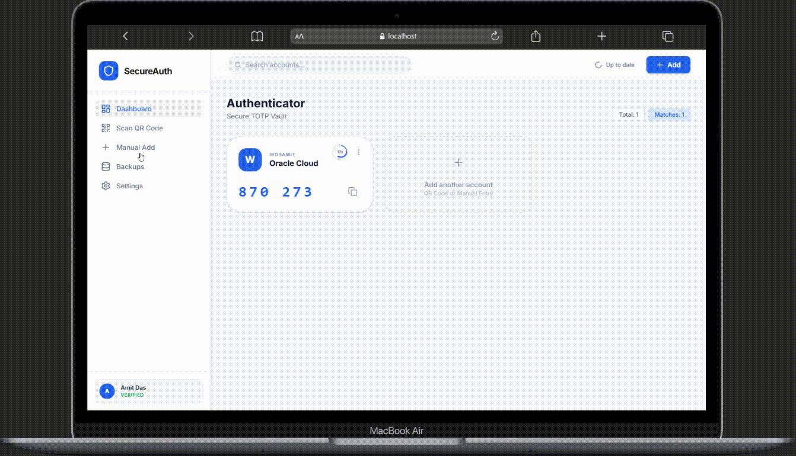

# SecureAuth

<p align="center">
  
</p>

<p align="center">
  <b>Advanced Authentication & Secure Authenticator Management Platform 🔐</b>
</p>

<h1 align="center">SecureAuth</h1>

<p align="center">
  <b>Secure • Fast • Modern ⚡</b><br>
  Developed by <a href="https://www.amitdas.site/">Amit Das</a>
</p>

---

## 🚀 Overview

**SecureAuth** is a modern full-stack authentication platform built for secure OTP authentication, encrypted authenticator account management, session monitoring, and advanced account protection.

The platform provides secure WhatsApp OTP verification, JWT-based authentication, encrypted account storage, multi-device session management, backup & restore functionality, and PWA support.

Built with performance and security in mind, SecureAuth delivers a reliable authentication experience for modern applications.

---

## ✨ Features

### 🔐 Authentication System

* WhatsApp OTP Authentication
* JWT-based Secure Authentication
* HTTP-only Cookie Sessions
* Secure OTP Expiration Handling
* Rate Limited Authentication Endpoints

### 📱 Session Management

* Multi-device Session Support
* Active Session Tracking
* Remote Session Revocation
* Current Device Detection
* Session Activity Monitoring

### 🛡️ Security Features

* AES Encryption for Sensitive Data
* Secure PIN-based App Lock
* Helmet Security Middleware
* Express Rate Limiting
* Encrypted Backup System
* Secure Session Validation

### 🔑 Authenticator Features

* Store Authenticator Accounts
* Encrypted Secret Storage
* Account Rename Support
* Backup & Restore Accounts
* TOTP Account Management
* Oracle Authenticator Support

### ⚡ Additional Features

* Progressive Web App (PWA)
* Responsive UI Design
* Firebase Realtime Database Integration
* WhatsApp OTP Delivery via TextSnap
* Secure Cloud Sync

---

## 🧠 How It Works

1. User enters phone number
2. OTP is generated securely
3. OTP sent via WhatsApp
4. User verifies OTP
5. JWT session created securely
6. Session stored in Firebase
7. User accesses protected dashboard
8. Authenticator accounts encrypted before storage

---

## 📸 Preview

<p align="center">
  
</p>

---

## ⚡ Quick Start

### Clone Repository

```bash
git clone https://github.com/AmitDas4321/SecureAuth.git
cd SecureAuth
```

### Install Dependencies

```bash
npm install
```

### Setup Environment Variables

Create a `.env` file in the root directory:

```env
# ===============================================
# SecureAuth - ENVIRONMENT CONFIGURATION
# ===============================================

APP_NAME="SecureAuth"
APP_URL="https://example.com"

# TEXTSNAP CONFIG
TEXTSNAP_INSTANCE_ID="YOUR_INSTANCE_ID"
TEXTSNAP_ACCESS_TOKEN="YOUR_ACCESS_TOKEN"

# FIREBASE CONFIG
FIREBASE_DATABASE_URL="YOUR_FIREBASE_DATABASE_URL"
FIREBASE_DATABASE_SECRET="YOUR_FIREBASE_DATABASE_SECRET"

# SECURITY CONFIG
JWT_SECRET="YOUR_SECRET_KEY"
ENCRYPTION_KEY="YOUR_ENCRYPTION_KEY"
```

### Start Development Server

```bash
npm run dev
```

Open:

```txt
http://localhost:3000
```

---

## 🏗️ Tech Stack

### Frontend

* React
* TypeScript
* Vite
* Tailwind CSS

### Backend

* Express.js
* JWT Authentication
* Firebase Realtime Database

### Security

* AES Encryption
* Helmet
* Express Rate Limit

### Services

* TextSnap API
* Firebase Realtime Database

---

## 📁 Project Structure

```txt
SecureAuth
├── dist/
├── node_modules/
├── src/
├── .env
├── .env.example
├── .gitignore
├── index.html
├── metadata.json
├── package-lock.json
├── package.json
├── README.md
├── server.ts
├── tsconfig.json
├── vite.config.ts
```

---

## 🔌 API Endpoints

### Authentication

| Endpoint                     | Method | Description      |
| ---------------------------- | ------ | ---------------- |
| `/api/auth/send-otp`         | POST   | Send OTP         |
| `/api/auth/verify-otp`       | POST   | Verify OTP       |
| `/api/auth/me`               | GET    | Get current user |
| `/api/auth/logout`           | POST   | Logout user      |
| `/api/auth/complete-profile` | POST   | Complete profile |

---

### Session Management

| Endpoint                        | Method | Description               |
| ------------------------------- | ------ | ------------------------- |
| `/api/auth/sessions`            | GET    | Get active sessions       |
| `/api/auth/sessions/others`     | DELETE | Revoke all other sessions |
| `/api/auth/sessions/:sessionId` | DELETE | Revoke specific session   |

---

### App Lock

| Endpoint                      | Method | Description                |
| ----------------------------- | ------ | -------------------------- |
| `/api/auth/app-lock/setup`    | POST   | Setup app lock             |
| `/api/auth/app-lock/verify`   | POST   | Verify PIN                 |
| `/api/auth/app-lock/toggle`   | POST   | Enable or disable app lock |
| `/api/auth/app-lock/settings` | POST   | Update app lock settings   |

---

### Authenticator Accounts

| Endpoint                   | Method | Description    |
| -------------------------- | ------ | -------------- |
| `/api/accounts`            | GET    | Get accounts   |
| `/api/accounts`            | POST   | Add account    |
| `/api/accounts/:id`        | PUT    | Update account |
| `/api/accounts/:id`        | DELETE | Delete account |
| `/api/accounts/:id/rename` | PATCH  | Rename account |

---

### Backup System

| Endpoint             | Method | Description             |
| -------------------- | ------ | ----------------------- |
| `/api/backup/export` | POST   | Export encrypted backup |
| `/api/backup/import` | POST   | Import backup           |

---

## 🔒 Security Architecture

SecureAuth uses multiple layers of security:

* JWT session validation
* Secure HTTP-only cookies
* AES encryption for sensitive data
* Rate-limited API requests
* PIN hashing for app lock
* Session revocation support
* OTP expiration system

---

## 📦 Build Project

```bash
npm run build
```

---

## 🚀 Production Deployment

### Start Production Server

```bash
npm start
```

---

## 🖥️ Run with PM2

```bash
npm install -g pm2

pm2 start server.ts --name secureauth --interpreter tsx

pm2 save
pm2 startup
```

---

## 🌍 Nginx Configuration

```nginx
server {
    server_name yourdomain.com;

    location / {
        proxy_pass http://localhost:3000;
        proxy_set_header Host $host;
    }
}
```

---

## 🐳 Docker Support

```bash
docker build -t secureauth .
docker run -p 3000:3000 --env-file .env secureauth
```

---

## ⚠️ Production Recommendations

* Use HTTPS
* Protect environment variables
* Enable firewall security
* Use strong JWT secrets
* Monitor server logs
* Rotate credentials regularly
* Backup encrypted data safely

---

## 📬 Support

<p align="center">
  <a href="https://t.me/BlueOrbitDevs">
    
  </a>
</p>

---

## 📜 License

MIT License © 2026 Amit Das

---

<p align="center">
  <b>Made with ❤️ by <a href="https://amitdas.site">Amit Das</a></b><br>
  ☕ Support development: <a href="https://paypal.me/AmitDas4321">PayPal.me/AmitDas4321</a>
</p>